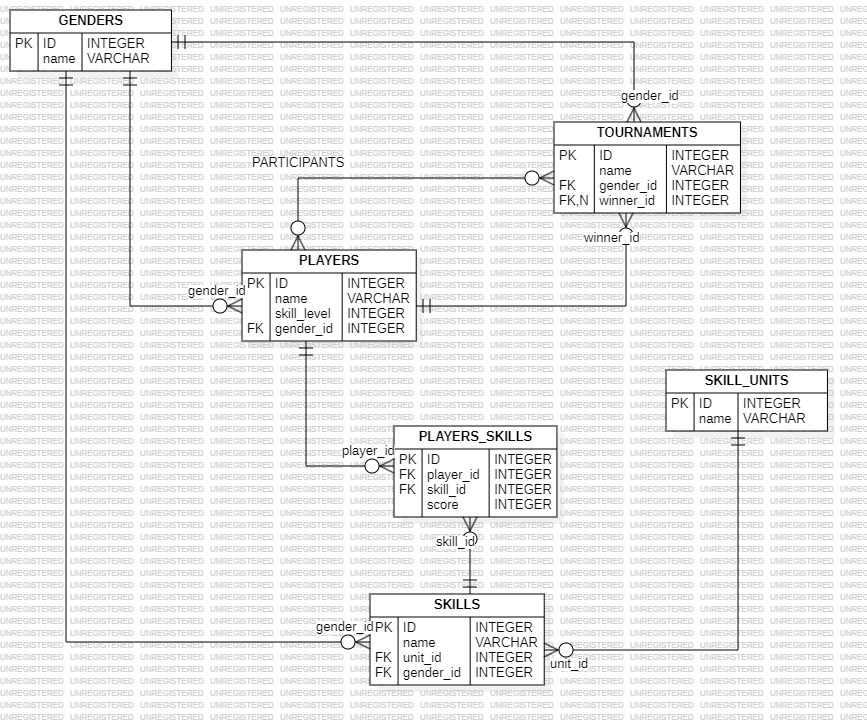

# Proyecto Simulación Torneo de Tenis

## Guía de Instalación y Configuración del Proyecto Laravel con Sail

Este proyecto esta desarrollado con _Laravel_ y se utilizó _Laravel Sail_ para facilitar la ejecución en contenedores Docker.
A continuación se describen los pasos necesarios para levantar y ejecutar el proyecto.

## Requisitos previos

Antes de comenzar, asegúrate de tener instalados los siguientes requisitos en tu máquina:

1. _Docker_: [Instalar Docker](https://www.docker.com/get-started)
2. _Git_: [Instalar Git](https://git-scm.com/book/en/v2/Getting-Started-Installing-Git)
3. _WSL2_: [Instalar WSL2](https://learn.microsoft.com/en-us/windows/wsl/install) (en Windows)

## Pasos para la configuración del proyecto

### 1. Clonar el repositorio

Comienza clonando el repositorio en tu máquina local desde bash:

`git clone https://github.com/egarofalo/tennis-tournament.git`

### 2. Instalar las dependencias ingresando al container:

```
    cd tennis-tournament

    docker run --rm \
        -u "$(id -u):$(id -g)" \
        -v "$(pwd):/var/www/html" \
        -w /var/www/html \
        laravelsail/php84-composer:latest \
        composer install --ignore-platform-reqs
```

### 3. Configurar el entorno de Laravel con Sail

Configura el archivo `.env` en el directorio raíz del proyecto:

`cp .env.example .env`

El archivo `.env.example` ya tiene la configuración necesaria para poder levantar el container del proyecto exitosamente. En caso de que sea necesario, modificar el archivo `.env`.

### 4. Levantar los contenedores con Sail

`./vendor/bin/sail up -d`

### 5. Ejecutar las migraciones y seeders

`./vendor/bin/sail artisan migrate:fresh --seed`

En las migraciones se generan jugadores y torneos (sin comenzar) con fake data para poder probar los endpoints con Postman.

Documentación de los endpoints con Swagger en: http://localhost/api/documentation

## Diagrama de entidad relación


